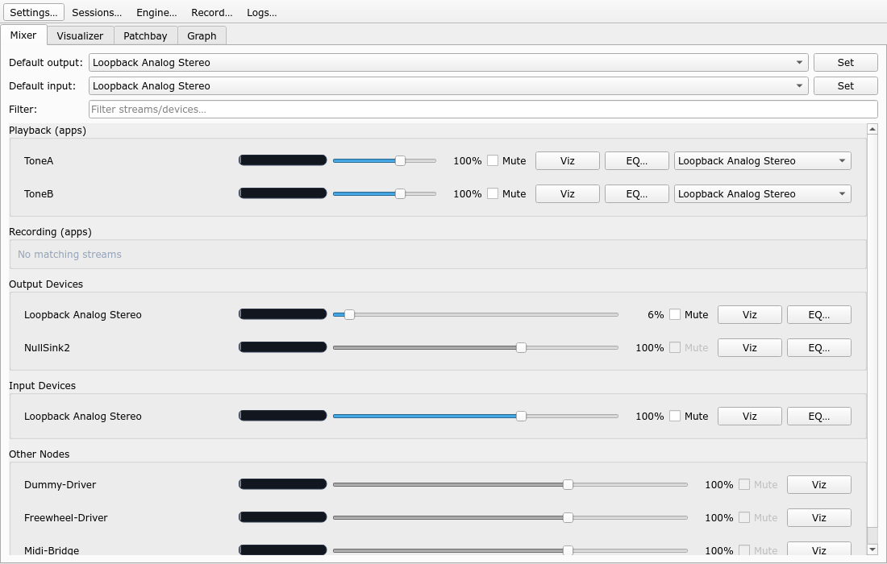
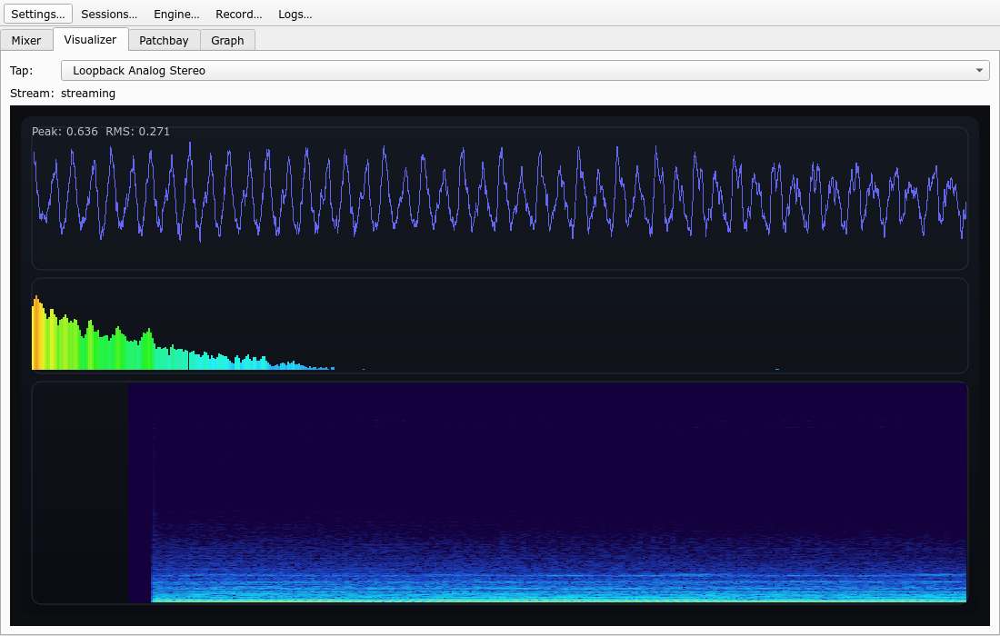
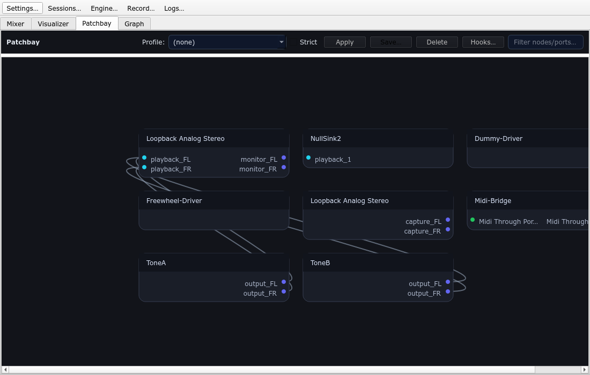
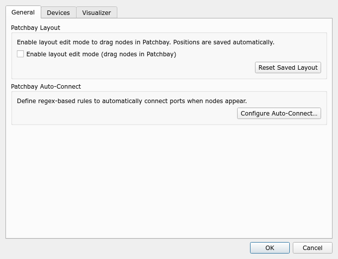
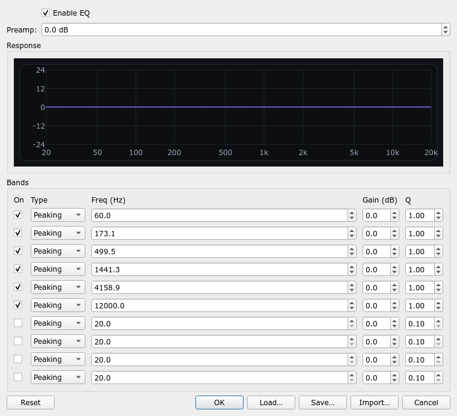
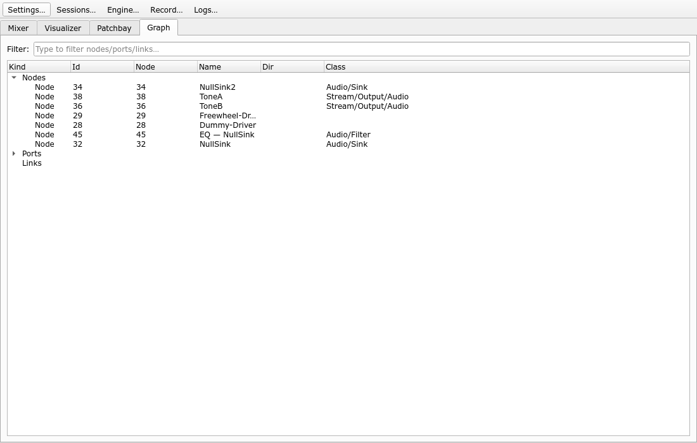

# Headroom

PipeWire-first mixer + patchbay + visualizers (waveform + spectrum + spectrogram), aimed as a modern replacement for pavucontrol with QjackCtl-inspired routing UX.

## Screenshots














More: `screenshots/index.html`

Tip: regenerate these locally with `./scripts/make_screenshots.sh`.

## Inspiration


## Features (MVP)

- Mixer: volume + mute for apps/streams/devices.
- Visualizer: waveform + spectrum + spectrogram (selectable tap target).
- Patchbay: connect/disconnect nodes by clicking ports + save/apply routing profiles + auto-connect rules (regex + whitelist/blacklist).
- Engine control: start/stop/restart PipeWire + WirePlumber (systemd user units).
- Sessions: named snapshots (links + defaults + EQ + layout) with one-click restore.
- Settings: reorder output devices (affects Mixer + Patchbay).
- Parametric EQ: per-device *and per-app stream* EQ (inserted as an in-graph PipeWire filter), with response curve preview, preset save/load, and AutoEQ/Squiglink import.

## Build (local)

Dependencies: Qt 6, CMake, pkg-config, PipeWire development headers. Optional: `ncursesw` (for `headroom-tui`).

```bash
cmake -S . -B build -DCMAKE_BUILD_TYPE=Release
cmake --build build -j
./build/headroom
```

Build flags:

- Disable TUI: `-DHEADROOM_BUILD_TUI=OFF`
- Disable CLI: `-DHEADROOM_BUILD_CLI=OFF`

## CLI / SSH

```bash
# TUI (ncurses)
./build/headroom-tui
# keys: Tab/F1-F8 pages, ? help, Enter set default output/input, [ ] reorder outputs, S/T/R engine start/stop/restart

# Non-interactive CLI
./build/headroomctl sinks
./build/headroomctl sinks order
./build/headroomctl sinks order move <node-id|node-name> up|down|top|bottom
./build/headroomctl sinks order reset
./build/headroomctl default-sink
./build/headroomctl default-sink set <node-id|node-name>
./build/headroomctl set-volume <node-id> 120%
./build/headroomctl mute <node-id> toggle

# Patchbay routing profiles
./build/headroomctl patchbay save studio
./build/headroomctl patchbay apply studio --strict

# Patchbay auto-connect rules (regex)
./build/headroomctl patchbay autoconnect enable on
./build/headroomctl patchbay autoconnect rule add toNullSink "ToneA" ".*" "Headroom-NullSink(\\n|$)" ".*"
./build/headroomctl patchbay autoconnect apply

# Sessions (snapshots)
./build/headroomctl session save work
./build/headroomctl session list
./build/headroomctl session apply work --strict-links

# Engine control (systemd user units)
./build/headroomctl engine status
./build/headroomctl engine restart pipewire
```

## Install (system)

```bash
cmake --install build
```

## Flatpak

Manifest: `flatpak/com.maxheadroom.Headroom.json`

Build + install locally:

```bash
flatpak-builder --force-clean --user --install flatpak-build flatpak/com.maxheadroom.Headroom.json
flatpak run com.maxheadroom.Headroom
```

Run CLI inside the sandbox:

```bash
flatpak run --command=headroomctl com.maxheadroom.Headroom sinks
```

Note: the Flatpak manifest currently disables `headroom-tui` to keep dependencies/permissions minimal.

Reference source: `https://www.tigerstrypes.com/wp-content/uploads/2016/02/198dkmwc750ubjpg.jpg`
