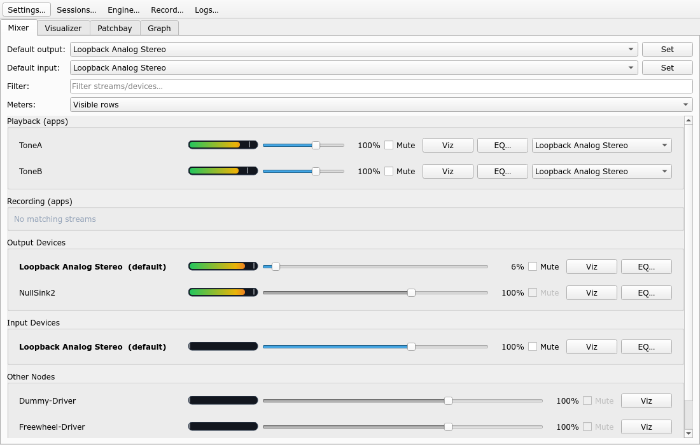
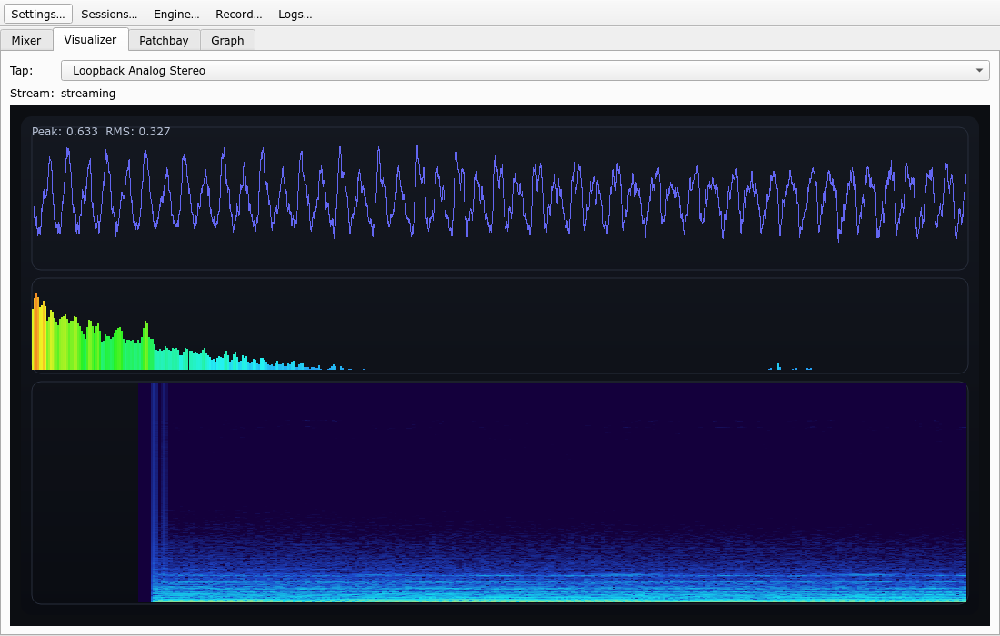
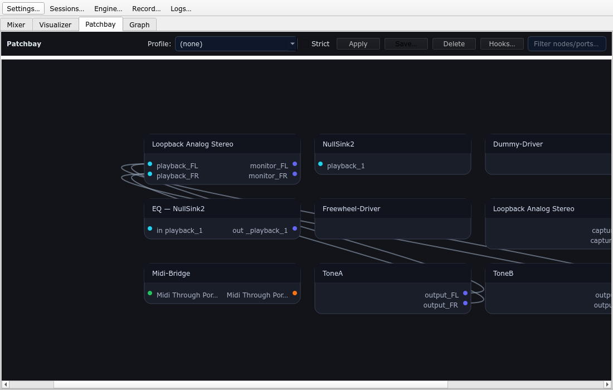
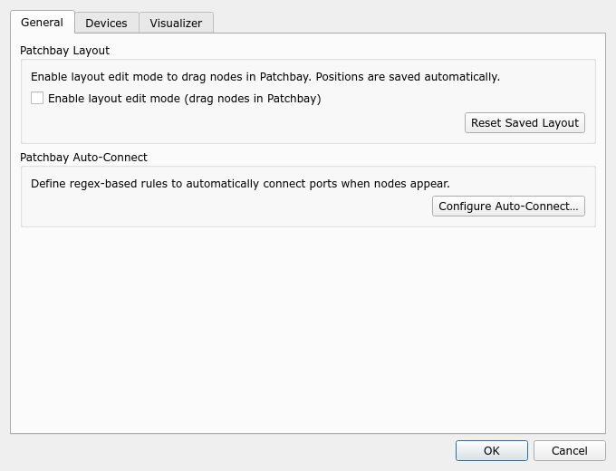
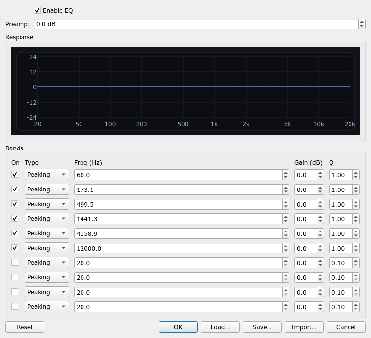
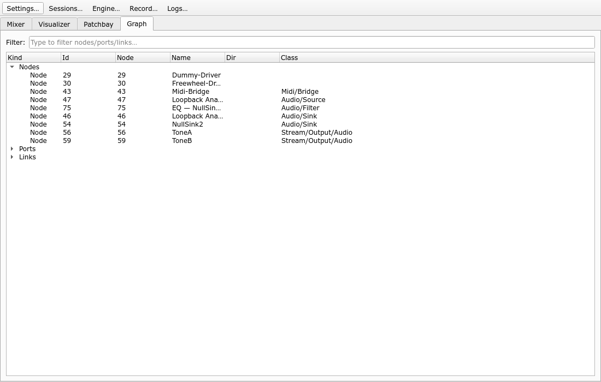
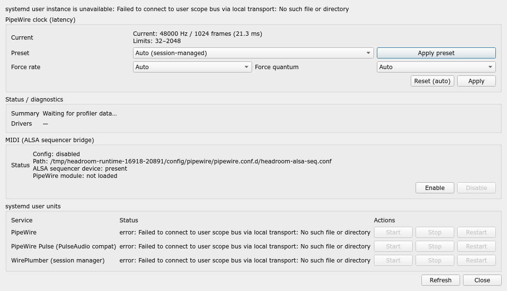
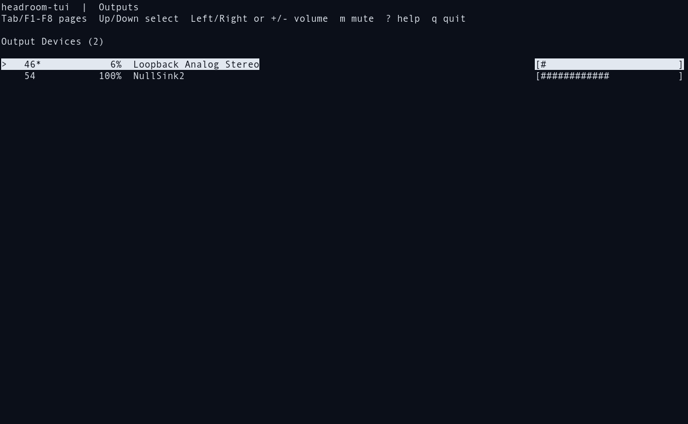
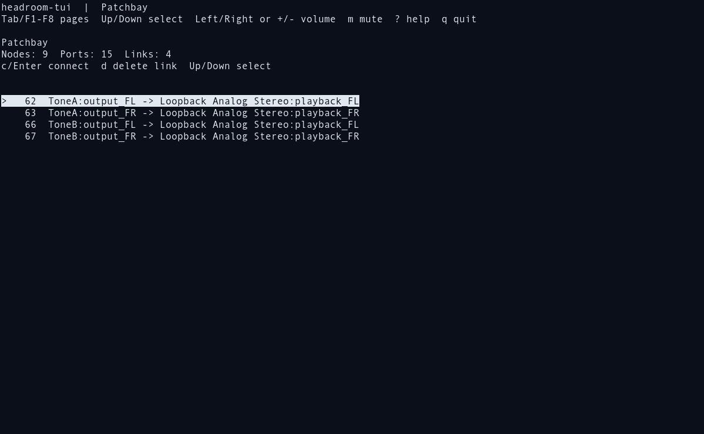
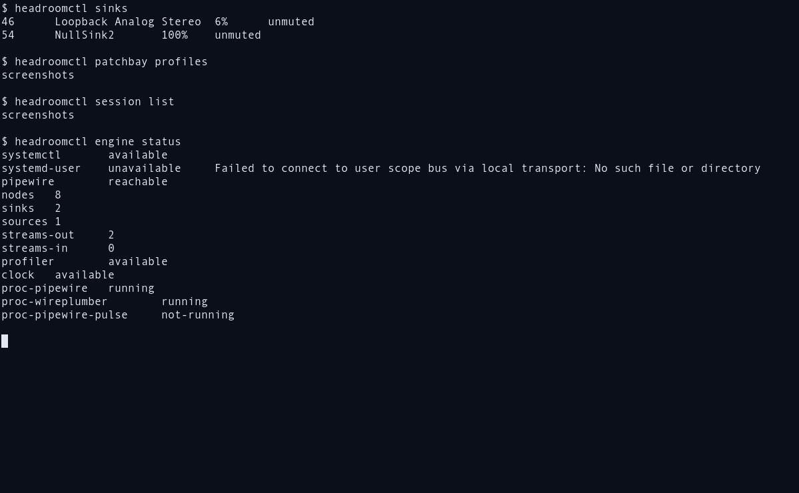

# Headroom

PipeWire-first mixer + patchbay + visualizers (waveform + spectrum + spectrogram), aimed as a modern replacement for pavucontrol with QjackCtl-inspired routing UX.

## Screenshots






















More: `screenshots/index.html`

Tip: regenerate these locally with `./scripts/make_screenshots.sh`.

## Inspiration


## Features (MVP)

- Mixer: volume + mute for apps/streams/devices.
- Visualizer: waveform + spectrum + spectrogram (selectable tap target).
- Patchbay: connect/disconnect nodes by clicking ports + save/apply routing profiles + auto-connect rules (regex + whitelist/blacklist).
- Engine control: start/stop/restart PipeWire + WirePlumber (systemd user units).
- Sessions: named snapshots (links + defaults + EQ + layout) with one-click restore.
- Settings: reorder output devices (affects Mixer + Patchbay).
- Parametric EQ: per-device *and per-app stream* EQ (inserted as an in-graph PipeWire filter), with response curve preview, preset save/load, and AutoEQ/Squiglink import.

## Install (prebuilt)

Recommended: Flatpak (cross-distro, no local build needed).

Releases currently ship a **Linux x86_64 Flatpak bundle** (a precompiled app), named like `headroom-v0.1.1.flatpak`.

Download the `.flatpak` bundle from GitHub Releases, then:

One-time setup (install Flatpak + ensure Flathub is configured for runtimes):

```bash
flatpak remote-add --user --if-not-exists flathub https://flathub.org/repo/flathub.flatpakrepo
```

Install (per-user):

```bash
flatpak install --user --bundle ./headroom-vX.Y.Z.flatpak
```

Run:

```bash
flatpak run com.maxheadroom.Headroom
```

Update:

```bash
flatpak install --user --bundle ./headroom-vX.Y.Z.flatpak
# If Flatpak says it's already installed, add: --reinstall
```

Uninstall:

```bash
flatpak uninstall --user com.maxheadroom.Headroom
```

## Build (local)

Dependencies: Qt 6, CMake, Ninja, pkg-config, PipeWire development headers. Optional: `ncursesw` (for `headroom-tui`).

Note: some Qt 6 builds require Vulkan dev packages at configure-time. If you see a Vulkan error during `cmake -S`, install your distro's Vulkan loader/headers (e.g. `libvulkan-dev` on Debian/Ubuntu).

Tip: install `ccache` for faster rebuilds (CMake will use it automatically if found).

```bash
cmake -S . -B build -GNinja -DCMAKE_BUILD_TYPE=Release
cmake --build build --parallel
./build/headroom
```

Build flags:

- Disable GUI (build `headroomctl` / `headroom-tui` only): `-DHEADROOM_BUILD_GUI=OFF`
- Disable TUI: `-DHEADROOM_BUILD_TUI=OFF`
- Disable CLI: `-DHEADROOM_BUILD_CLI=OFF`
- Disable tests: `-DHEADROOM_BUILD_TESTS=OFF`

If your machine hangs/reboots during the compile, try limiting parallelism: `cmake --build build --parallel 1`

## Tests

```bash
cmake -S . -B build -GNinja -DHEADROOM_BUILD_TESTS=ON
cmake --build build --parallel
ctest --test-dir build --output-on-failure
```

## Debug logging

Headroom captures Qt + PipeWire library logs in the **Logs…** dialog.

To debug volume/mute and other control interactions, enable extra (opt-in) logs:

- `HEADROOM_DEBUG_PW_OPS=1` logs the PipeWire operations Headroom sends (set volume/mute, default device writes, link connect/disconnect).
- `HEADROOM_DEBUG_PW_CONTROLS=1` logs incoming node control updates from PipeWire (volume/mute readbacks).
- `HEADROOM_DEBUG_PW_NODE=<id|substring|all>` optionally filters the above to a specific node (example: `id:42` or `Firefox`).
- `HEADROOM_DEBUG_PW_RATE=1` enables rate-limited counters for PipeWire graph churn (useful for diagnosing UI flicker).

Examples:

```bash
# Log volume writes + readbacks (all nodes)
HEADROOM_DEBUG_PW_OPS=1 HEADROOM_DEBUG_PW_CONTROLS=1 ./build/headroom

# Only log one node (by id or substring)
HEADROOM_DEBUG_PW_OPS=1 HEADROOM_DEBUG_PW_CONTROLS=1 HEADROOM_DEBUG_PW_NODE=id:42 ./build/headroom
HEADROOM_DEBUG_PW_OPS=1 HEADROOM_DEBUG_PW_CONTROLS=1 HEADROOM_DEBUG_PW_NODE=Firefox ./build/headroom
```

Real-host validation (PipeWire + systemd user session; avoid `sudo`):

```bash
./scripts/host_test.sh --run-gui-self-tests --efficiency-audit --efficiency-duration 300
```

## CLI / SSH

```bash
# TUI (ncurses)
./build/headroom-tui
# keys: Tab/F1-F8 pages, ? help, Enter set default output/input, [ ] reorder outputs, S/T/R engine start/stop/restart

# Non-interactive CLI
./build/headroomctl sinks
./build/headroomctl sinks order
./build/headroomctl sinks order move <node-id|node-name> up|down|top|bottom
./build/headroomctl sinks order reset
./build/headroomctl default-sink
./build/headroomctl default-sink set <node-id|node-name>
./build/headroomctl set-volume <node-id> 120%
./build/headroomctl mute <node-id> toggle

# Patchbay routing profiles
./build/headroomctl patchbay save studio
./build/headroomctl patchbay apply studio --strict

# Patchbay auto-connect rules (regex)
./build/headroomctl patchbay autoconnect enable on
./build/headroomctl patchbay autoconnect rule add toNullSink "ToneA" ".*" "Headroom-NullSink(\\n|$)" ".*"
./build/headroomctl patchbay autoconnect apply

# Sessions (snapshots)
./build/headroomctl session save work
./build/headroomctl session list
./build/headroomctl session apply work --strict-links

# Engine control (systemd user units)
./build/headroomctl engine status
./build/headroomctl engine restart pipewire
```

## Install (system)

```bash
cmake --install build
```

## Flatpak

Manifest: `flatpak/com.maxheadroom.Headroom.json`

Build + install locally:

```bash
flatpak-builder --force-clean --user --install flatpak-build flatpak/com.maxheadroom.Headroom.json
flatpak run com.maxheadroom.Headroom
```

Run CLI inside the sandbox:

```bash
flatpak run --command=headroomctl com.maxheadroom.Headroom sinks
```

Note: the Flatpak manifest currently disables `headroom-tui` to keep dependencies/permissions minimal.

Reference source: `https://www.tigerstrypes.com/wp-content/uploads/2016/02/198dkmwc750ubjpg.jpg`
